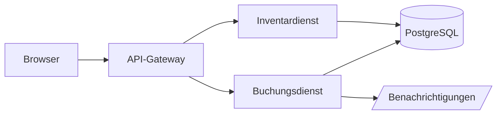
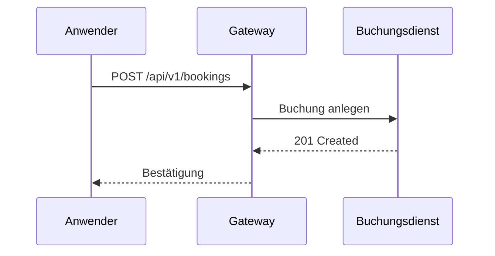

# md2pdf

**Deutsch** · [English](README.md)

`md2pdf` wandelt eine Markdown-Datei in ein druckreifes PDF um. Es ist als
einzelnes Binary ausgeliefert, braucht also keine Laufzeitumgebung, und nutzt
für das eigentliche Rendern eine bereits auf dem System vorhandene
Chromium-Engine (Chromium, Chrome, Brave oder Edge) im Headless-Modus über
das Chrome DevTools Protocol.

Zielgruppe ist Anwenderdokumentation: Handbücher, Betriebsanleitungen,
technische Beschreibungen — Dokumente mit Deckblatt, Inhaltsverzeichnis,
nummerierten Kapiteln, Tabellen und Codebeispielen, die am Ende als PDF an
Nutzerinnen und Nutzer gehen.

Sechs eingebaute **Style-Presets** decken die üblichen Dokumenttypen ab, ein
vorzeigbares PDF braucht also kein eigenes CSS — siehe [Presets](#presets).

Hinweis: Programmmeldungen und Hilfetexte von md2pdf sind englisch. Die
Beschriftungen **im erzeugten PDF** (Callout-Titel, „Inhalt", „Seite x von
y", „Abbildung 1: …") bleiben zweisprachig und folgen `lang` bzw. `--lang`.

## Voraussetzungen

md2pdf bringt kein eigenes Chromium mit, sondern sucht eine bereits
installierte Chromium-basierte Browser-Engine. Die Suche läuft in dieser
Reihenfolge, der erste Treffer gewinnt:

1. `--browser-path <pfad>` — explizit angegebener Pfad. Existiert er nicht
   oder ist er nicht ausführbar, bricht md2pdf sofort ab (kein Fallback auf
   die folgenden Schritte).
2. Umgebungsvariable `MD2PDF_BROWSER`, nach der gleichen Regel.
3. `PATH`-Suche nach den Programmnamen `chromium`, `chromium-browser`,
   `google-chrome-stable`, `google-chrome`, `brave-browser`,
   `microsoft-edge`, `microsoft-edge-stable`, in dieser Reihenfolge.
4. Bekannte Installationspfade je Betriebssystem, z. B. unter Linux
   `/usr/bin/chromium`, `/usr/bin/chromium-browser`,
   `/usr/bin/google-chrome-stable`, `/snap/bin/chromium`,
   `/var/lib/flatpak/exports/bin/org.chromium.Chromium`; unter Windows die
   üblichen Installationsorte von Edge und Chrome unter `%ProgramFiles%`,
   `%ProgramFiles(x86)%` und `%LOCALAPPDATA%`.

Wird nichts gefunden, bricht md2pdf mit Exit-Code 3 ab und nennt auf stderr
Installationshinweise für die gängigen Plattformen sowie den Ausweg über
`--browser-path`.

Unter Arch/CachyOS lässt sich Chromium so installieren:

```fish
paru -S chromium
```

## Installation / Bauen

Das Projekt ist reines Go (Modul `github.com/gstuebner/md2pdf`), es braucht
keine weiteren Systempakete zum Bauen.

Für den häufigsten Fall — je eine Fassung für Linux und Windows — gibt es
`build.sh`. Das Skript prüft vorher `go vet` und die Tests und legt beide
Binaries statisch gelinkt unter `dist/` ab:

```fish
./build.sh          # Version aus der Datei VERSION
./build.sh 1.2.0    # Version 1.2.0
```

Ergebnis sind `dist/md2pdf` und `dist/md2pdf.exe`.

Feiner steuerbar ist das `Makefile`:

```fish
make build
```

Das Binary landet unter `dist/md2pdf` (für die aktuell laufende Plattform).
Für andere Zielplattformen:

```fish
make build-all
```

Das erzeugt `dist/md2pdf_linux_amd64`, `dist/md2pdf_linux_arm64` und
`dist/md2pdf_windows_amd64.exe`. Die eingebettete Versionsnummer lässt sich
überschreiben:

```fish
make build VERSION=2.4.0
```

Ohne Angabe lesen beide Build-Wege die Datei `VERSION` im Wurzelverzeichnis —
sie ist die einzige Quelle für die Versionsnummer. Ein Release heißt also:
`VERSION` anpassen und den Commit taggen. `md2pdf --version` und die letzte
Zeile von `md2pdf --help` melden sie dann:

```
md2pdf 1.1.1 · Gregor Stübner & Claude (Anthropic)
```

Ein nacktes `go build .` umgeht das Linker-Flag und fällt auf die
Modulversion zurück, die die Go-Toolchain vermerkt hat (`go install …@v1.1.1`),
sonst auf `dev`.

Weitere Ziele: `make test` (Go-Tests), `make vet` (`go vet`), `make fmt`
(prüft mit `gofmt -l`, ob Dateien ungeformt sind), `make clean` (entfernt
`dist/`).

## Schnellstart

```fish
md2pdf handbuch.md
```

Erzeugt `handbuch.pdf` im selben Verzeichnis. Ein eigener Zielpfad:

```fish
md2pdf handbuch.md -o /tmp/out.pdf
```

Ein anderes Aussehen:

```fish
md2pdf handbuch.md --preset technical
md2pdf handbuch.md -p t              # dasselbe, abgekürzt
```

## Presets

Ein Preset bündelt ein Stylesheet mit den Struktur-Vorgaben, die dazu
gehören: ob das Dokument ein Deckblatt und ein Inhaltsverzeichnis bekommt, ob
Kapitel nummeriert werden und mit welchen Seitenrändern gesetzt wird.
`md2pdf --list-presets` zeigt die Namen mit einer Kurzbeschreibung:

| Preset      | Optik                                                                 | Deckblatt | Inhalt | Nummern | Ränder              |
| ----------- | --------------------------------------------------------------------- | --------- | ------ | ------- | ------------------- |
| `classic`   | schlichtes Bürodokument: dunkelblaue Linie unter dem Titel, Haarlinie unter jedem Kapitel, vollberandete Tabellen | nein | nein     | nein | `20mm`                |
| `modern`    | die bisherige md2pdf-Optik: Akzentleiste am Kapitel, Sprach-Badges an Codeblöcken, nummerierte Abbildungen | ja   | ja (3)   | ja   | `25mm 20mm 20mm 20mm` |
| `technical` | dichtes Handbuch: kleinere Schrift, betonte Codeblöcke, ein Kapitel je Seite | ja   | ja (4)   | ja   | `25mm 20mm 20mm 20mm` |
| `report`    | Geschäftsbericht: Source Serif im Fließtext, serifenlose Überschriften, ruhige Tabellen | ja   | ja (2)   | nein | `30mm 25mm 25mm 25mm` |
| `plain`     | graustufig und fast schmucklos, Basis für eigenes `--css`              | nein | nein     | nein | `20mm`                |
| `handout`   | Querformat-Handout: große Schrift, ein Kapitel je Seite                | nein | nein     | nein | `18mm`                |

`classic` ist der Default. Die bisherige Standardoptik ist `--preset modern`.

Das Flag hat die Kurzform `-p`, und ein eindeutiger Präfix des Namens genügt —
jedes Preset ist über seinen Anfangsbuchstaben erreichbar, also `-p c`,
`-p m`, `-p t`, `-p r`, `-p p` und `-p h`.

Ein Preset füllt nur, was nicht ausdrücklich gesetzt wurde — jedes Flag auf
der Kommandozeile schlägt es:

```fish
md2pdf handbuch.md --preset classic --toc-depth 3   # classic, aber mit Inhalt
md2pdf handbuch.md --preset handout --landscape=false
```

Ein Dokument kann sein Preset auch selbst festlegen; `--preset` überschreibt
das weiterhin:

```markdown
---
title: Aurora Desk
preset: technical
---
```

Preset und `--css` ergänzen sich: die `--css`-Dateien werden zuletzt geladen
und überschreiben das Preset. Ein Preset plus ein paar überschriebene Custom
Properties reicht daher meist für eigenes Branding.

## Frontmatter

Metadaten stehen als YAML-Frontmatter am Anfang der Markdown-Datei. Alle
Felder sind optional; CLI-Flags überschreiben sie feldweise (siehe unten,
Metadatenpräzedenz).

| Feld       | Bedeutung                                                                 |
| ---------- | -------------------------------------------------------------------------- |
| `title`    | Dokumenttitel auf dem Deckblatt. Fehlt er, wird die erste H1-Überschrift des Dokuments verwendet und aus dem Fließtext entfernt. |
| `subtitle` | Untertitel unter dem Titel auf dem Deckblatt.                              |
| `kicker`   | Kurze Zeile über dem Titel, z. B. eine Dokumentkategorie. Default `Dokumentation` bzw. `Documentation`, je nach Dokumentsprache. |
| `version`  | Dokumentversion (nicht die Programmversion von md2pdf), erscheint auf Deckblatt und in der Kopfzeile. |
| `author`   | Autor bzw. Autorin, erscheint auf dem Deckblatt.                           |
| `company`  | Herausgeber/Firma, erscheint auf dem Deckblatt und, falls gesetzt, in der Fußzeile. |
| `date`     | Anzeigeform des Datums, z. B. `05.09.2026`. Fehlt es, wird das heutige Datum eingesetzt — bei `lang: de` als `TT.MM.JJJJ`, sonst als `JJJJ-MM-TT`. |
| `logo`     | Pfad zu einer Bilddatei, relativ zur Markdown-Datei, für das Deckblatt.    |
| `lang`     | Sprache der generierten Textbausteine (Callout-Titel, „Seite/von", Überschrift des Inhaltsverzeichnisses, Bildunterschriften). Unterstützt `de` und `en`; ohne Angabe zieht md2pdf die Locale aus `LC_ALL`/`LANG` heran und fällt auf `en` zurück. |
| `preset`   | Style-Preset für dieses Dokument, siehe [Presets](#presets). `--preset` überschreibt es. |

Beispiel (angelehnt an `testdata/showcase.md`):

```markdown
---
title: Aurora Desk
subtitle: Anwenderhandbuch für die Arbeitsplatzverwaltung
kicker: Handbuch
version: 2.4.0
author: Dokumentationsteam
company: Beispiel GmbH
date: 05.09.2026
lang: de
preset: modern
---

# Aurora Desk

## Einführung
…
```

## Alle Flags

| Flag                     | Default                       | Bedeutung                                                        |
| ------------------------ | ------------------------------ | ----------------------------------------------------------------- |
| `-o, --output`           | Eingabename mit `.pdf`         | Ziel-PDF.                                                          |
| `--css`                  | keine                          | Zusätzliche CSS-Datei, mehrfach angebbar; wird nach dem Theme geladen und gewinnt. |
| `--title`                | leer                           | Überschreibt den Titel aus dem Frontmatter.                        |
| `--subtitle`             | leer                           | Überschreibt den Untertitel aus dem Frontmatter.                   |
| `--kicker`               | leer                           | Überschreibt den Kicker aus dem Frontmatter.                       |
| `--doc-version`          | leer                           | Überschreibt die Dokumentversion aus dem Frontmatter (nicht die Programmversion). |
| `--author`               | leer                           | Überschreibt den Autor aus dem Frontmatter.                        |
| `--company`              | leer                           | Überschreibt den Herausgeber aus dem Frontmatter.                  |
| `--date`                 | leer                           | Überschreibt das Datum aus dem Frontmatter.                        |
| `--logo`                 | leer                           | Überschreibt den Logo-Pfad aus dem Frontmatter.                    |
| `--lang`                 | Locale, sonst `en`             | Sprache der Beschriftungen (`de` oder `en`): Callout-Titel, Überschrift des Inhaltsverzeichnisses, Bildunterschriften, Wörter in der Fußzeile. Überschreibt das Frontmatter. |
| `-p, --preset`           | `classic`                      | Style-Preset, siehe [Presets](#presets). Ein eindeutiger Präfix genügt (`-p c`). Überschreibt ein `preset` im Frontmatter. |
| `--list-presets`         | `false`                        | Listet die eingebauten Presets mit Kurzbeschreibung und beendet sich. |
| `--no-toc`               | Preset                         | Kein Inhaltsverzeichnis.                                           |
| `--toc-depth`            | Preset                         | Tiefe des Inhaltsverzeichnisses (Überschriftenebenen). Eine Tiefe anzugeben schaltet das Inhaltsverzeichnis ein; `--no-toc` schlägt es weiterhin. |
| `--no-cover`             | Preset                         | Kein Deckblatt.                                                    |
| `--no-numbering`         | Preset                         | Keine Kapitelnummern.                                              |
| `--force-numbering`      | `false`                        | Nummeriert auch dann, wenn md2pdf eigene Kapitelnummern im Dokument erkannt hat. |
| `--chapter-pages`        | Preset                         | Jedes Kapitel (H2) beginnt auf einer neuen Seite.                  |
| `--paper`                | `A4`                           | Papierformat: `A4`, `A5`, `Letter` oder `Legal`.                   |
| `--landscape`            | Preset                         | Querformat.                                                        |
| `--margin`               | Preset                         | Seitenränder: 1 Wert (alle Seiten), 2 Werte (vertikal horizontal) oder 4 Werte (oben rechts unten links); Einheiten `mm`, `cm`, `in`, `pt` (ohne Einheit: `mm`). |
| `--no-header`            | Preset                         | Keine laufende Kopfzeile.                                          |
| `--no-footer`            | Preset                         | Keine Fußzeile (damit auch keine Seitenzahlen).                    |
| `--header-template`      | leer                           | Eigenes Chromium-Kopfzeilentemplate (Datei).                       |
| `--footer-template`      | leer                           | Eigenes Chromium-Fußzeilentemplate (Datei).                        |
| `--browser-path`         | leer                           | Expliziter Pfad zur Browser-Engine (siehe Voraussetzungen).        |
| `--browser-arg`          | keine                          | Zusätzliches Chromium-Kommandozeilenargument, mehrfach angebbar.   |
| `--html-out`             | leer                           | Speichert das erzeugte HTML zusätzlich in dieser Datei (Debug).    |
| `--timeout`              | `60s`                          | Render-Timeout für den Headless-Browser.                           |
| `--no-outline`           | `false`                        | Keine PDF-Lesezeichen.                                             |
| `-q, --quiet`            | `false`                        | Keine Erfolgsmeldung auf stdout.                                   |
| `-v, --version`          | `false`                        | Zeigt die Programmversion und beendet sich.                        |

Metadatenpräzedenz: CLI-Flag > Frontmatter > eingebauter Default. Dasselbe
gilt für das Preset und für die Struktur-Optionen, die ein Preset mitbringt:
CLI-Flag > Preset (`--preset`, sonst `preset:` im Frontmatter, sonst
`classic`).

## Markdown-Umfang

md2pdf unterstützt GitHub Flavored Markdown (Tabellen, Aufgabenlisten,
Durchstreichen, automatische Verlinkung von URLs), dazu Definitionslisten,
Fußnoten und typografische Ersetzungen (z. B. gerade Anführungszeichen zu
typografischen, `--` zu Gedankenstrich).

Drei Besonderheiten gehen über reines GFM hinaus:

- **GitHub-Alerts** (`> [!NOTE] …`) werden zu farbigen Hinweisboxen mit Icon.
  Unterstützt werden `NOTE`, `TIP`, `IMPORTANT`, `WARNING` und `CAUTION`.
- Ein **Absatz, der nur aus einem Bild besteht**, wird automatisch zu einer
  nummerierten Abbildung mit Bildunterschrift („Abbildung 1: …“, englisch
  „Figure 1: …“). Nicht jedes Preset nummeriert Abbildungen — `classic` und
  `plain` setzen die Unterschrift schlicht. Als
  Beschriftung dient der Titel des Bildes (``); ist
  kein Titel gesetzt, wird der Alt-Text verwendet. Sind beide leer, entfällt
  die Bildunterschrift, die Abbildung bleibt aber nummeriert.
- ` ```mermaid `-Codeblöcke werden nicht als Text, sondern als Vektorgrafik
  gerendert. Mermaid ist mitgeliefert, das funktioniert also offline. Siehe
  [Mermaid-Diagramme](#mermaid-diagramme) weiter unten.

### Mermaid-Diagramme

Ein Codeblock mit der Auszeichnung `mermaid` wird zum Diagramm. GitHub
versteht dieselben Blöcke, deshalb steht jedes Beispiel unten zweimal: erst
das Markdown, das du schreibst, dann das Bild, das daraus wird — hier auf
GitHub und genauso im PDF.

Du schreibst:

````markdown

````

Und bekommst:


Sequenzdiagramme gehen genauso. Du schreibst:

````markdown

````

Und bekommst:


Im PDF übernimmt das Diagramm die Farben des Presets (`--accent`, `--ink`,
`--rule`) und passt damit zum übrigen Dokument. In `testdata/showcase.md`
stehen beide Beispiele im Zusammenhang.

## Kapitelnummerierung

Wo das Preset die Nummerierung einschaltet (`modern`, `technical`),
nummeriert md2pdf die Kapitel selbst: H2 wird zu `1`, `2`, `3`,
H3 zu `1.1`, `1.2` und so weiter, im Fließtext wie im Inhaltsverzeichnis.

Viele Dokumente bringen ihre Nummern aber schon in den Überschriften mit
(`## 1. Einleitung`). Damit daraus kein „1 1. Einleitung" wird, prüft md2pdf
die H2-Überschriften: tragen mindestens zwei davon und mindestens 60 Prozent
eine eigene Nummer, schaltet sich die automatische Nummerierung ab und meldet
das auf stderr. Die Nummern des Dokuments bleiben dann unangetastet — das ist
wichtig, weil der Fließtext sich oft darauf bezieht („siehe Abschnitt 5").

Als Nummer gilt `1`, `1.`, `1)`, `1.2` oder `1.2.` am Anfang der Überschrift.
Eine allein stehende Zahl wird nur bis zwei Stellen erkannt, damit
Überschriften wie `## 2026 im Rückblick` nicht fälschlich als Gliederung
durchgehen.

Beide Richtungen lassen sich erzwingen: `--no-numbering` schaltet die
automatische Nummerierung immer ab, `--force-numbering` immer an.

## Eigenes Branding

Jedes Preset legt sämtliche Farben, Schriftgrößen und Abstände als CSS Custom
Properties auf `:root` ab (z. B. `--accent`, `--ink`, `--font-body`,
`--size-body`). Eine `--css`-Datei wird nach dem Preset geladen und kann
diese Variablen einfach überschreiben, ohne die Regeln selbst nachbauen zu
müssen:

```fish
md2pdf handbuch.md --preset modern --css eigenes-branding.css
```

Ein vollständiges Beispiel liegt unter `design/branding-example.css`. Eine
statische Vorschau aller unterstützten Markdown-Elemente liegt unter
`design/preview.html`, lässt sich direkt im Browser öffnen und schaltet oben
rechts zwischen den Presets um.

## Bekannte Einschränkungen

Chromium zeichnet die per `--header-template`/`--footer-template` bzw. das
Standard-Template gesteuerte Kopf- und Fußzeile beim PDF-Druck auf **jeder**
Seite, einschließlich des Deckblatts. Das lässt sich nicht per CSS
unterdrücken — weder eine benannte `@page`-Regel für das Deckblatt noch
`@page :first { margin: 0 }` in Kombination mit CSS-Seitengrößen ändert
daran etwas, beide Wege wurden getestet. Ein zweiter Druckdurchlauf ohne
Kopf-/Fußzeile für das Deckblatt, anschließend mit dem Hauptteil
zusammengeführt, wurde ebenfalls in Betracht gezogen und wieder verworfen:
das Zusammenführen zweier PDFs verliert dabei einen Großteil der
PDF-Lesezeichen und internen Verlinkungen.

Wer ein Deckblatt ohne Kopf-/Fußzeile braucht, hat zwei Auswege:

- `--no-header` und/oder `--no-footer` verzichten für das ganze Dokument auf
  Kopf- bzw. Fußzeile (damit auch auf dem Deckblatt).
- Ein eigenes `--header-template`/`--footer-template` kann inhaltlich leer
  gestaltet werden, erscheint aber weiterhin als leerer Rand auf jeder Seite.

## Exit-Codes

| Code | Bedeutung                          |
| ---- | ----------------------------------- |
| `0`  | Erfolgreich konvertiert.             |
| `1`  | Fehler beim Lesen der Eingabe oder bei der Konvertierung. |
| `2`  | Ungültige Kommandozeilenargumente.   |
| `3`  | Keine Chromium-basierte Browser-Engine gefunden. |
| `4`  | Render-Timeout im Headless-Browser überschritten. |
