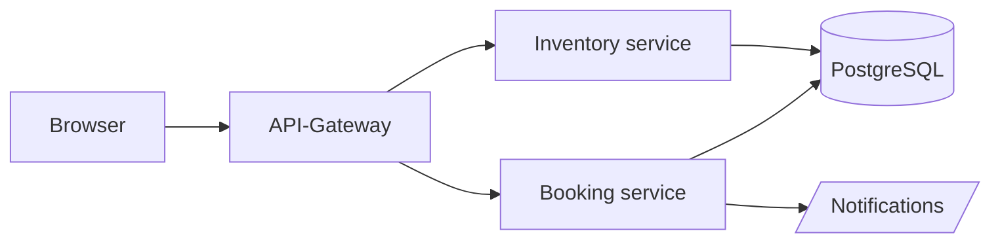
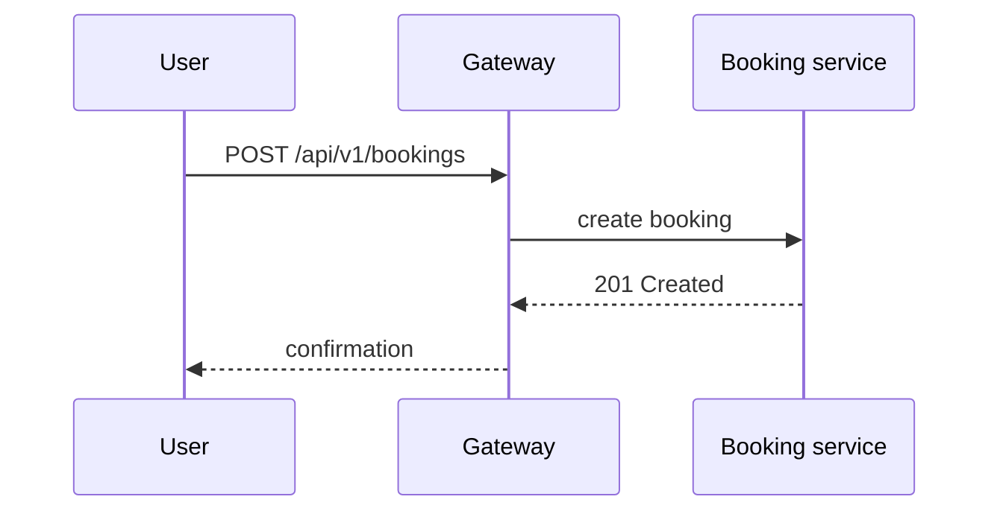

# md2pdf

[Deutsch](README.de.md) · **English**

`md2pdf` converts a Markdown file into a print-ready PDF. It ships as a
single binary, so it needs no runtime, and renders through a Chromium-based
engine already installed on the system (Chromium, Chrome, Brave, or Edge) in
headless mode via the Chrome DevTools Protocol.

It targets end-user documentation: manuals, operating instructions,
technical descriptions — documents with a cover page, table of contents,
numbered chapters, tables, and code examples that ultimately ship to users
as a PDF.

Six built-in **style presets** cover the common document types, so getting a
presentable PDF needs no CSS of your own — see [Presets](#presets).

## Requirements

md2pdf doesn't bundle its own Chromium; instead it looks for an already
installed Chromium-based browser engine. The search runs in this order, and
the first match wins:

1. `--browser-path <path>` — an explicitly given path. If it doesn't exist
   or isn't executable, md2pdf aborts immediately (no fallback to the steps
   below).
2. The `MD2PDF_BROWSER` environment variable, following the same rule.
3. A `PATH` search for the program names `chromium`, `chromium-browser`,
   `google-chrome-stable`, `google-chrome`, `brave-browser`,
   `microsoft-edge`, `microsoft-edge-stable`, in that order.
4. Known per-OS install locations, e.g. on Linux `/usr/bin/chromium`,
   `/usr/bin/chromium-browser`, `/usr/bin/google-chrome-stable`,
   `/snap/bin/chromium`, `/var/lib/flatpak/exports/bin/org.chromium.Chromium`;
   on Windows, the usual Edge and Chrome install locations under
   `%ProgramFiles%`, `%ProgramFiles(x86)%`, and `%LOCALAPPDATA%`.

If nothing is found, md2pdf aborts with exit code 3 and prints install hints
for the common platforms, plus the `--browser-path` escape hatch, to
stderr.

On Arch/CachyOS, Chromium installs like this:

```fish
paru -S chromium
```

## Installation / Building

The project is pure Go (module `github.com/gstuebner/md2pdf`) and needs no
additional system packages to build.

For the most common case — one build each for Linux and Windows — there's
`build.sh`. The script runs `go vet` and the tests first, then drops both
statically linked binaries under `dist/`:

```fish
./build.sh          # version from the VERSION file
./build.sh 1.2.0    # version 1.2.0
```

This produces `dist/md2pdf` and `dist/md2pdf.exe`.

For finer control there's the `Makefile`:

```fish
make build
```

The binary lands at `dist/md2pdf` (for the platform you're currently
running). For other target platforms:

```fish
make build-all
```

This produces `dist/md2pdf_linux_amd64`, `dist/md2pdf_linux_arm64`, and
`dist/md2pdf_windows_amd64.exe`. The embedded version number can be
overridden:

```fish
make build VERSION=2.4.0
```

Without it, both build paths read the `VERSION` file at the repository root —
that file is the single source of truth for the version, so a release means
editing it and tagging the commit. `md2pdf --version` and the last line of
`md2pdf --help` then report it:

```
md2pdf 1.1.0 · Gregor Stübner & Claude (Anthropic)
```

A plain `go build .` bypasses the linker flag and falls back to the module
version the Go toolchain recorded (`go install …@v1.1.0`), or to `dev` when
there is none.

Other targets: `make test` (Go tests), `make vet` (`go vet`), `make fmt`
(checks with `gofmt -l` whether any files are unformatted), `make clean`
(removes `dist/`).

## Quick start

```fish
md2pdf handbuch.md
```

This creates `handbuch.pdf` in the same directory. To choose a different
destination:

```fish
md2pdf handbuch.md -o /tmp/out.pdf
```

To pick a different look:

```fish
md2pdf handbuch.md --preset technical
md2pdf handbuch.md -p t              # the same, abbreviated
```

## Presets

A preset bundles a stylesheet with the structural defaults that go with it —
whether the document gets a cover page and a table of contents, whether
chapters are numbered, and which page margins are used. `md2pdf
--list-presets` prints the names with a one-line description:

| Preset      | Look                                                                 | Cover | Contents | Numbering | Margins             |
| ----------- | -------------------------------------------------------------------- | ----- | -------- | --------- | ------------------- |
| `classic`   | plain office document: dark blue rule under the title, hairline under each chapter, fully bordered tables | no  | no          | no  | `20mm`                |
| `modern`    | the original md2pdf look: accent bar next to each chapter, language badges on code blocks, numbered figures | yes | yes (3)     | yes | `25mm 20mm 20mm 20mm` |
| `technical` | dense manual: smaller type, emphasised code blocks, one chapter per page | yes | yes (4)     | yes | `25mm 20mm 20mm 20mm` |
| `report`    | business report: Source Serif body text, sans-serif headings, quiet tables | yes | yes (2)     | no  | `30mm 25mm 25mm 25mm` |
| `plain`     | greyscale and almost unstyled, a base for your own `--css`            | no    | no          | no  | `20mm`                |
| `handout`   | landscape handout: large type, one chapter per page                   | no    | no          | no  | `18mm`                |

`classic` is the default. The old default look is `--preset modern`.

The flag has the short form `-p`, and an unambiguous prefix of the name is
enough — every preset is reachable by its first letter, so `-p c`, `-p m`,
`-p t`, `-p r`, `-p p` and `-p h` all work.

A preset only fills in what you left alone — every flag on the command line
wins over it:

```fish
md2pdf handbuch.md --preset classic --toc-depth 3   # classic, but with contents
md2pdf handbuch.md --preset handout --landscape=false
```

A document can also name its preset itself, which `--preset` still overrides:

```markdown
---
title: Aurora Desk
preset: technical
---
```

Presets and `--css` combine: the `--css` files load last and override the
preset, so a preset plus a handful of overridden custom properties is usually
enough for corporate branding.

## Frontmatter

Metadata lives in a YAML frontmatter block at the top of the Markdown file.
All fields are optional; CLI flags override them field by field (see
Metadata precedence below).

| Field      | Meaning                                                                 |
| ---------- | -------------------------------------------------------------------------- |
| `title`    | Document title on the cover page. If missing, the document's first H1 heading is used instead and removed from the body text. |
| `subtitle` | Subtitle shown under the title on the cover page.                          |
| `kicker`   | Short line above the title, e.g. a document category. Defaults to `Documentation` (`Dokumentation` when the document language is German). |
| `version`  | Document version (not md2pdf's own program version); appears on the cover page and in the header. |
| `author`   | Author, appears on the cover page.                                         |
| `company`  | Publisher/company, appears on the cover page and, if set, in the footer.   |
| `date`     | Display form of the date, e.g. `2026-09-05`. If missing, today's date is inserted (`YYYY-MM-DD`, or `DD.MM.YYYY` when the document language is German). |
| `logo`     | Path to an image file, relative to the Markdown file, for the cover page. |
| `lang`     | Language of the generated text snippets (callout titles, "Page/of", table-of-contents heading, figure captions). Supports `de` and `en`; without it md2pdf uses the locale from `LC_ALL`/`LANG` and falls back to `en`. |
| `preset`   | Style preset for this document, see [Presets](#presets). `--preset` overrides it. |

Example (based on `testdata/showcase.md`):

```markdown
---
title: Aurora Desk
subtitle: Anwenderhandbuch für die Arbeitsplatzverwaltung
kicker: Handbuch
version: 2.4.0
author: Dokumentationsteam
company: Beispiel GmbH
date: 05.09.2026
lang: de
preset: modern
---

# Aurora Desk

## Einführung
…
```

## All flags

| Flag                     | Default                       | Description                                                        |
| ------------------------ | ------------------------------ | ----------------------------------------------------------------- |
| `-o, --output`           | input name with `.pdf`         | Output PDF.                                                        |
| `--css`                  | none                            | Extra CSS file, repeatable; loaded after the theme and takes precedence. |
| `--title`                | empty                           | Overrides the title from the frontmatter.                          |
| `--subtitle`             | empty                           | Overrides the subtitle from the frontmatter.                       |
| `--kicker`               | empty                           | Overrides the kicker from the frontmatter.                         |
| `--doc-version`          | empty                           | Overrides the document version from the frontmatter (not the program version). |
| `--author`               | empty                           | Overrides the author from the frontmatter.                         |
| `--company`              | empty                           | Overrides the publisher from the frontmatter.                      |
| `--date`                 | empty                           | Overrides the date from the frontmatter.                           |
| `--logo`                 | empty                           | Overrides the logo path from the frontmatter.                      |
| `--lang`                 | locale, else `en`               | Language of the labels (`de` or `en`): callout titles, table-of-contents heading, figure captions, footer words. Overrides the frontmatter. |
| `-p, --preset`           | `classic`                       | Style preset, see [Presets](#presets). An unambiguous prefix is enough (`-p c`). Overrides a `preset` in the frontmatter. |
| `--list-presets`         | `false`                         | Lists the built-in presets with a one-line description and exits.  |
| `--no-toc`               | preset                          | No table of contents.                                              |
| `--toc-depth`            | preset                          | Depth of the table of contents (heading levels). Naming a depth implies a table of contents; `--no-toc` still wins. |
| `--no-cover`             | preset                          | No cover page.                                                     |
| `--no-numbering`         | preset                          | No chapter numbers.                                                |
| `--force-numbering`      | `false`                        | Numbers chapters even when md2pdf has detected the document's own chapter numbers. |
| `--chapter-pages`        | preset                          | Each chapter (H2) starts on a new page.                             |
| `--paper`                | `A4`                           | Paper size: `A4`, `A5`, `Letter`, or `Legal`.                       |
| `--landscape`            | preset                          | Landscape orientation.                                              |
| `--margin`               | preset                          | Page margins: 1 value (all sides), 2 values (vertical horizontal), or 4 values (top right bottom left); units `mm`, `cm`, `in`, `pt` (no unit: `mm`). |
| `--no-header`            | preset                          | No running header.                                                  |
| `--no-footer`            | preset                          | No footer (which also removes page numbers).                       |
| `--header-template`      | empty                           | Custom Chromium header template (file).                            |
| `--footer-template`      | empty                           | Custom Chromium footer template (file).                            |
| `--browser-path`         | empty                           | Explicit path to the browser engine (see Requirements).            |
| `--browser-arg`          | none                            | Extra Chromium command-line argument, repeatable.                  |
| `--html-out`             | empty                           | Also saves the generated HTML to this file (debug).                |
| `--timeout`              | `60s`                          | Render timeout for the headless browser.                            |
| `--no-outline`           | `false`                        | No PDF bookmarks.                                                   |
| `-q, --quiet`            | `false`                        | No success message on stdout.                                      |
| `-v, --version`          | `false`                        | Prints the program version and exits.                              |

Metadata precedence: CLI flag > frontmatter > built-in default. The same
holds for the preset and for the structural options a preset carries: CLI
flag > preset (`--preset`, else `preset:` in the frontmatter, else
`classic`).

## Supported Markdown

md2pdf supports GitHub Flavored Markdown (tables, task lists,
strikethrough, automatic URL linking), plus definition lists, footnotes,
and typographic substitutions (e.g., straight quotes become curly quotes,
`--` becomes a dash).

Three features go beyond plain GFM:

- **GitHub alerts** (`> [!NOTE] …`) become colored callout boxes with an
  icon. Supported: `NOTE`, `TIP`, `IMPORTANT`, `WARNING`, and `CAUTION`.
- A **paragraph that consists of nothing but an image** automatically
  becomes a numbered figure with a caption ("Figure 1: …", "Abbildung 1: …"
  in German). Not every preset numbers figures — `classic` and `plain` leave
  the caption plain. The image's
  title (``) is used as the caption; if no title is
  set, the alt text is used instead. If both are empty, the caption is
  omitted, but the figure stays numbered.
- ` ```mermaid ` code blocks are rendered as vector graphics rather than as
  text. Mermaid is bundled, so this works offline. See
  [Mermaid diagrams](#mermaid-diagrams) below.

### Mermaid diagrams

A fenced block tagged `mermaid` becomes a diagram. GitHub understands the same
blocks, so each example below appears twice: first the Markdown you write,
then the picture it turns into — here on GitHub, and the same way in the PDF.

You write:

````markdown

````

And get:


Sequence diagrams work the same way. You write:

````markdown

````

And get:


In the PDF the diagram picks up the preset's colours (`--accent`, `--ink`,
`--rule`), so it fits the rest of the document. `testdata/showcase.md`
contains both examples in context.

## Chapter numbering

Where the preset switches numbering on (`modern`, `technical`), md2pdf
numbers chapters itself: H2 becomes `1`, `2`, `3`, H3
becomes `1.1`, `1.2`, and so on, both in the body text and in the table of
contents.

Many documents already carry their own numbers in the headings
(`## 1. Introduction`). So that this doesn't turn into "1 1. Introduction",
md2pdf inspects the H2 headings: if at least two of them, and at least 60
percent, carry their own number, automatic numbering switches itself off
and reports this on stderr. The document's own numbers are then left
untouched — this matters because the body text often refers back to them
("see section 5").

A number is recognized as `1`, `1.`, `1)`, `1.2`, or `1.2.` at the start of
the heading. A bare number is only recognized up to two digits, so headings
like `## 2026 in review` don't get mistaken for outline numbers.

Both directions can be forced: `--no-numbering` always turns automatic
numbering off, `--force-numbering` always turns it on.

## Custom branding

Each preset defines all colors, font sizes, and spacing as CSS custom
properties on `:root` (e.g., `--accent`, `--ink`, `--font-body`,
`--size-body`). A `--css` file loads after the preset and can simply
override these variables without having to rebuild the rules themselves:

```fish
md2pdf handbuch.md --preset modern --css eigenes-branding.css
```

A complete example lives at `design/branding-example.css`. A static preview
of every supported Markdown element lives at `design/preview.html`, opens
directly in a browser, and can switch between presets in the top right
corner.

## Known limitations

Chromium draws the header and footer controlled by
`--header-template`/`--footer-template` (or the default template) on
**every** page during PDF printing, including the cover page. This can't be
suppressed via CSS — neither a named `@page` rule for the cover page nor
`@page :first { margin: 0 }` combined with CSS page sizes changes anything;
both approaches were tested. A second print pass without a header/footer
for the cover page, merged afterward with the main body, was also
considered and dropped again: merging two PDFs loses most of the PDF
bookmarks and internal links in the process.

If you need a cover page without a header/footer, there are two
workarounds:

- `--no-header` and/or `--no-footer` drop the header/footer for the whole
  document (including the cover page).
- A custom `--header-template`/`--footer-template` can be made visually
  empty, but it still shows up as blank margin space on every page.

## Exit codes

| Code | Meaning                             |
| ---- | ----------------------------------- |
| `0`  | Converted successfully.             |
| `1`  | Error reading the input or during conversion. |
| `2`  | Invalid command-line arguments.     |
| `3`  | No Chromium-based browser engine found. |
| `4`  | Render timeout exceeded in the headless browser. |
