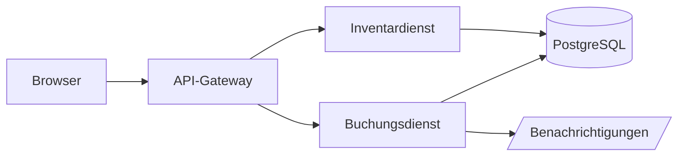
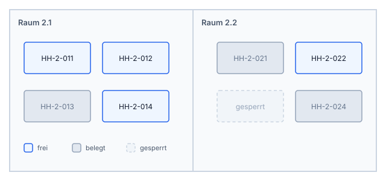
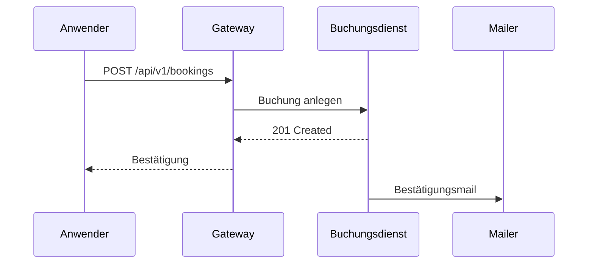

# Aurora Desk

## Einführung

Aurora Desk verwaltet Arbeitsplätze, Buchungen und Ausstattung an mehreren Standorten.
Dieses Handbuch beschreibt die tägliche Arbeit mit der Weboberfläche sowie die
Administration über die Kommandozeile. Es richtet sich an Anwenderinnen und Anwender
ohne Vorkenntnisse und an Administratoren, die Aurora Desk betreiben.

Begriffe, die in der Oberfläche erscheinen, sind im Text **fett** gesetzt.
Eingaben, Dateinamen und Kommandos erscheinen als `Festbreitenschrift`.
Weiterführende Hinweise stehen in Randbemerkungen[^1].

[^1]: Fußnoten erscheinen gesammelt am Ende des Dokuments.

> [!NOTE]
> Dieses Handbuch bezieht sich auf Version 2.4. Ältere Installationen finden die
> passende Fassung im Archiv unter *Hilfe → Dokumentation*.

### Systemvoraussetzungen

| Komponente     | Minimum                  | Empfohlen                    |
| -------------- | ------------------------ | ---------------------------- |
| Browser        | Firefox 120, Chrome 120  | jeweils aktuelle Version     |
| Bildschirm     | 1280 × 720               | 1920 × 1080 oder größer      |
| Netzwerk       | 2 Mbit/s                 | 10 Mbit/s                    |
| Serverseitig   | 2 vCPU, 4 GB RAM         | 4 vCPU, 8 GB RAM, SSD        |
| Datenbank      | PostgreSQL 14            | PostgreSQL 16                |

### Aufbau der Anwendung

Aurora Desk besteht aus drei Diensten, die unabhängig voneinander skaliert werden können.



## Installation

### Paket beziehen

Lade das passende Archiv von der Release-Seite und prüfe die Signatur, bevor du
es entpackst.

```bash
curl -LO https://example.com/aurora/aurora-desk-2.4.0-linux-amd64.tar.gz
curl -LO https://example.com/aurora/aurora-desk-2.4.0-linux-amd64.tar.gz.sha256
sha256sum -c aurora-desk-2.4.0-linux-amd64.tar.gz.sha256
tar xzf aurora-desk-2.4.0-linux-amd64.tar.gz
```

> [!WARNING]
> Entpacke das Archiv niemals in ein Verzeichnis, das bereits eine ältere
> Installation enthält. Vorhandene Konfigurationsdateien werden sonst überschrieben.

### Konfiguration

Die Konfiguration liegt als YAML-Datei unter `/etc/aurora/config.yaml`.

```yaml
server:
  listen: "0.0.0.0:8080"
  base_url: "https://desk.example.com"

database:
  dsn: "postgres://aurora@localhost:5432/aurora?sslmode=require"
  max_connections: 25

booking:
  # Wie weit im Voraus gebucht werden darf.
  horizon_days: 90
  allow_overlap: false
```

Die wichtigsten Schlüssel im Überblick:

Server
:   Netzwerkbindung und die nach außen sichtbare Basis-URL. Die Basis-URL landet in
    Einladungsmails und muss von außen erreichbar sein.

Database
:   Verbindungszeichenkette im DSN-Format. Für den Produktivbetrieb ist
    `sslmode=require` verpflichtend.

Booking
:   Fachliche Regeln für Buchungen, insbesondere der Buchungshorizont.

> [!IMPORTANT]
> Nach jeder Änderung an `config.yaml` muss der Dienst neu geladen werden:
> `systemctl reload aurora-desk`. Ein Neustart ist nicht nötig.

### Erststart

1. Datenbankschema anlegen: `aurora-desk migrate up`
2. Administrationskonto erzeugen: `aurora-desk user create --admin`
3. Dienst starten: `systemctl enable --now aurora-desk`
4. Im Browser `https://desk.example.com` öffnen und anmelden

Vor dem Erststart sollten folgende Punkte geklärt sein:

- Ein DNS-Eintrag zeigt auf den Server.
- Ein TLS-Zertifikat liegt vor.
  - Entweder über Let's Encrypt bezogen,
  - oder aus der internen PKI ausgestellt.
- Der Datenbankbenutzer existiert und hat Schreibrechte.

Fortschritt der Einrichtung:

- [x] Schema angelegt
- [x] Administrationskonto vorhanden
- [ ] SMTP-Zugang hinterlegt
- [ ] Standorte importiert

## Tägliche Arbeit

### Arbeitsplatz buchen

Wähle im Kalender einen Tag und anschließend im Grundriss einen freien Platz.
Freie Plätze sind blau, belegte grau und gesperrte schraffiert dargestellt.



> [!TIP]
> Mit gedrückter <kbd>Umschalt</kbd>-Taste lassen sich mehrere aufeinanderfolgende
> Tage in einem Zug buchen. Das spart bei wiederkehrenden Anwesenheiten viel Zeit.

### Buchung stornieren

Eine Buchung kann bis zum Beginn des gebuchten Tages storniert werden. Danach
bleibt sie als *verfallen* in der Historie stehen.

> [!CAUTION]
> Storniert eine Administratorin eine fremde Buchung, wird die betroffene Person
> automatisch per E-Mail informiert. Diese Benachrichtigung lässt sich nicht
> unterdrücken.

### Ausstattung suchen

Über die Suche lassen sich Plätze nach Ausstattung filtern. Die Suchsyntax
entspricht der Filtersprache der API:

```text
standort:hamburg ausstattung:dockingstation ausstattung:zweiter-monitor
```

## Automatisierung

### Kommandozeile

Alle Funktionen der Oberfläche stehen auch als Unterbefehl zur Verfügung.

```
aurora-desk booking list --user anna --from 2026-09-01 --to 2026-09-30
aurora-desk booking create --user anna --desk HH-2-014 --date 2026-09-08
aurora-desk booking cancel --id 4711
```

### API-Zugriff

Der folgende Ausschnitt zeigt einen minimalen Client in Go.

```go
package main

import (
	"context"
	"encoding/json"
	"fmt"
	"net/http"
	"time"
)

type Booking struct {
	ID   int       `json:"id"`
	Desk string    `json:"desk"`
	Date time.Time `json:"date"`
}

func list(ctx context.Context, token string) ([]Booking, error) {
	req, err := http.NewRequestWithContext(ctx, http.MethodGet,
		"https://desk.example.com/api/v1/bookings", nil)
	if err != nil {
		return nil, fmt.Errorf("build request: %w", err)
	}
	req.Header.Set("Authorization", "Bearer "+token)

	resp, err := http.DefaultClient.Do(req)
	if err != nil {
		return nil, fmt.Errorf("call api: %w", err)
	}
	defer resp.Body.Close()

	var out []Booking
	if err := json.NewDecoder(resp.Body).Decode(&out); err != nil {
		return nil, fmt.Errorf("decode: %w", err)
	}
	return out, nil
}
```

### Ablauf einer Buchung



## Fehlerbehebung

### Anmeldung schlägt fehl

Prüfe zuerst, ob die Basis-URL korrekt gesetzt ist. Ein häufiger Fehler ist eine
Basis-URL mit abschließendem Schrägstrich.

```diff
 server:
-  base_url: "https://desk.example.com/"
+  base_url: "https://desk.example.com"
```

### Bekannte Meldungen

| Meldung                          | Ursache                            | Abhilfe                                  |
| -------------------------------- | ---------------------------------- | ---------------------------------------- |
| `E1004 desk not bookable`        | Platz gesperrt oder außer Betrieb  | Sperrung im Inventar aufheben            |
| `E1017 horizon exceeded`         | Datum jenseits `horizon_days`      | Horizont erhöhen oder später buchen      |
| `E2003 smtp unavailable`         | Mailserver nicht erreichbar        | SMTP-Zugang und Firewallregeln prüfen    |
| `E5001 migration pending`        | Schema veraltet                    | `aurora-desk migrate up` ausführen       |

### Diagnosedaten sammeln

Für eine Supportanfrage hilft folgendes Paket:

```bash
aurora-desk diagnose --output /tmp/aurora-diagnose.zip
```

Es enthält Konfiguration (ohne Passwörter), Versionsinformationen und die
letzten 500 Logzeilen.

---

*Aurora Desk ist ein fiktives Produkt und dient hier ausschließlich als
Beispieldokument für das Layout.*
